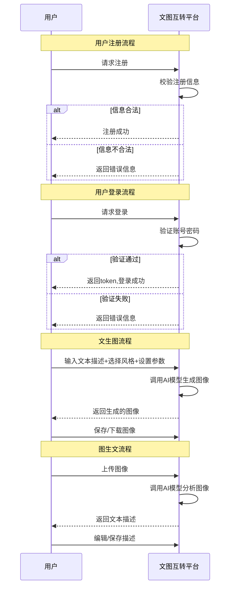
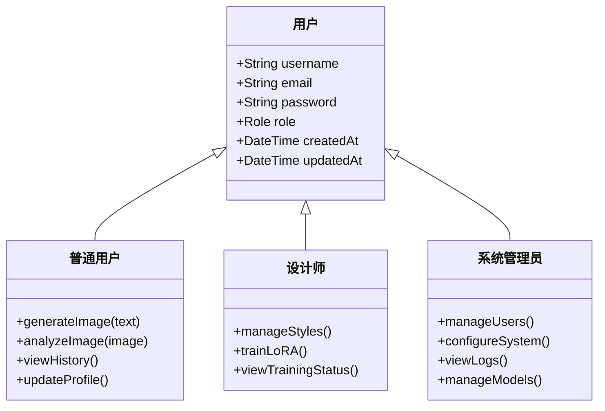
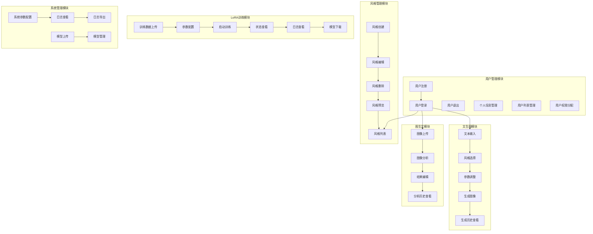
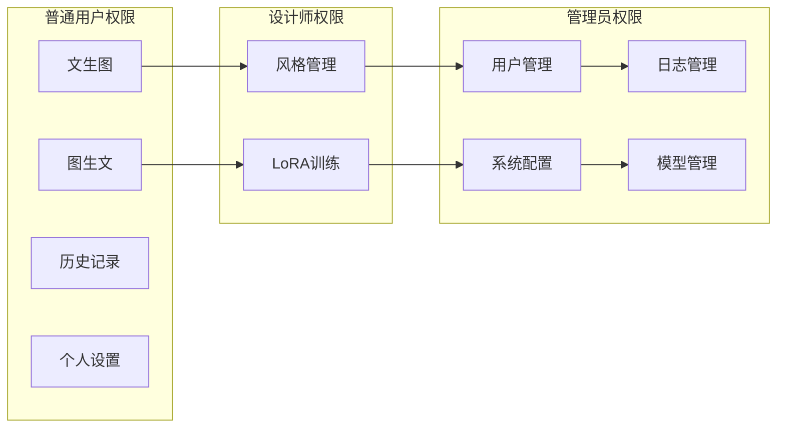
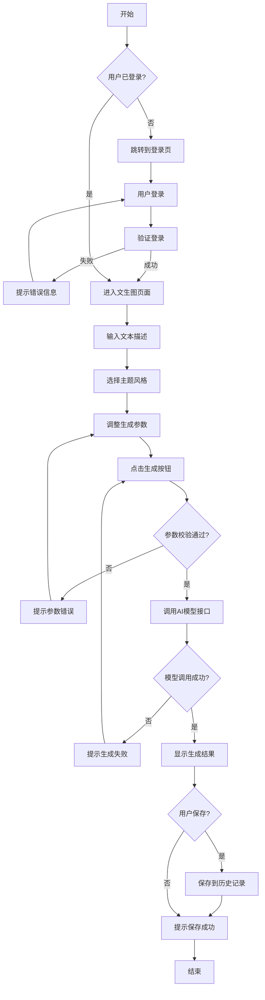
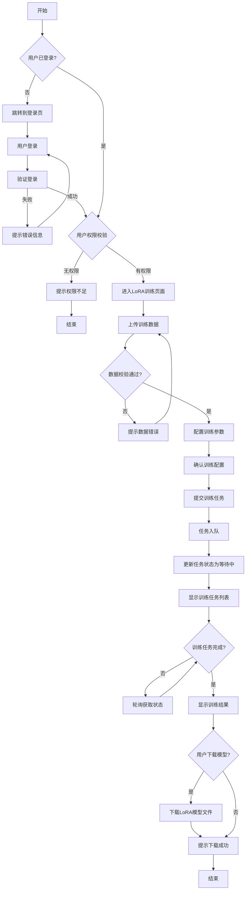

# 文图互转主题设计系统 - 系统用例图

## 1. 总体用例图

```mermaid
sequenceDiagram
    participant 用户 as 用户
    participant 系统 as 文图互转平台

    Note over 用户,系统: 用户注册流程
    用户->>系统: 请求注册
    系统->>系统: 校验注册信息
    alt 信息合法
        系统-->>用户: 注册成功
    else 信息不合法
        系统-->>用户: 返回错误信息
    end

    Note over 用户,系统: 用户登录流程
    用户->>系统: 请求登录
    系统->>系统: 验证账号密码
    alt 验证通过
        系统-->>用户: 返回token,登录成功
    else 验证失败
        系统-->>用户: 返回错误信息
    end

    Note over 用户,系统: 文生图流程
    用户->>系统: 输入文本描述+选择风格+设置参数
    系统->>系统: 调用AI模型生成图像
    系统-->>用户: 返回生成的图像
    用户->>系统: 保存/下载图像

    Note over 用户,系统: 图生文流程
    用户->>系统: 上传图像
    系统->>系统: 调用AI模型分析图像
    系统-->>用户: 返回文本描述
    用户->>系统: 编辑/保存描述
```

## 2. 角色关系图

```mermaid
classDiagram
    class 用户 {
        +String username
        +String email
        +String password
        +Role role
        +DateTime createdAt
        +DateTime updatedAt
    }
    
    class 普通用户 {
        +generateImage(text)
        +analyzeImage(image)
        +viewHistory()
        +updateProfile()
    }
    
    class 设计师 {
        +manageStyles()
        +trainLoRA()
        +viewTrainingStatus()
    }
    
    class 系统管理员 {
        +manageUsers()
        +configureSystem()
        +viewLogs()
        +manageModels()
    }
    
    用户 <|-- 普通用户
    用户 <|-- 设计师
    用户 <|-- 系统管理员
```

## 3. 核心功能用例图

```mermaid
graph TD
    subgraph 用户管理模块
        A1[用户注册]
        A2[用户登录]
        A3[用户退出]
        A4[个人信息管理]
        A5[用户列表管理]
        A6[用户权限分配]
    end
    
    subgraph 文生图模块
        B1[文本输入]
        B2[风格选择]
        B3[参数调整]
        B4[生成图像]
        B5[生成历史查看]
    end
    
    subgraph 图生文模块
        C1[图像上传]
        C2[图像分析]
        C3[结果编辑]
        C4[分析历史查看]
    end
    
    subgraph 风格管理模块
        D1[风格创建]
        D2[风格编辑]
        D3[风格删除]
        D4[风格预览]
        D5[风格列表]
    end
    
    subgraph LoRA训练模块
        E1[训练数据上传]
        E2[参数配置]
        E3[启动训练]
        E4[状态查看]
        E5[日志查看]
        E6[模型下载]
    end
    
    subgraph 系统管理模块
        F1[系统参数配置]
        F2[日志查看]
        F3[日志导出]
        F4[模型上传]
        F5[模型管理]
    end
    
    A1 --> A2
    A2 --> B1
    A2 --> C1
    A2 --> D5
    B1 --> B2
    B2 --> B3
    B3 --> B4
    B4 --> B5
    C1 --> C2
    C2 --> C3
    C3 --> C4
    D1 --> D2
    D2 --> D3
    D3 --> D4
    D4 --> D5
    E1 --> E2
    E2 --> E3
    E3 --> E4
    E4 --> E5
    E5 --> E6
    F1 --> F2
    F2 --> F3
    F4 --> F5
```

## 4. 用户角色权限矩阵

```mermaid
graph LR
    subgraph 普通用户权限
        U1[文生图]
        U2[图生文]
        U3[历史记录]
        U4[个人设置]
    end
    
    subgraph 设计师权限
        D1[风格管理]
        D2[LoRA训练]
    end
    
    subgraph 管理员权限
        A1[用户管理]
        A2[系统配置]
        A3[日志管理]
        A4[模型管理]
    end
    
    U1 --> D1
    U2 --> D2
    D1 --> A1
    D2 --> A2
    A1 --> A3
    A2 --> A4
```

## 5. 文生文核心业务流程图

```mermaid
flowchart TD
    A[开始] --> B{用户已登录?}
    B -->|否| C[跳转到登录页]
    C --> D[用户登录]
    D --> E[验证登录]
    E -->|失败| F[提示错误信息]
    F --> D
    E -->|成功| G[进入文生图页面]
    B -->|是| G
    G --> H[输入文本描述]
    H --> I[选择主题风格]
    I --> J[调整生成参数]
    J --> K[点击生成按钮]
    K --> L{参数校验通过?}
    L -->|否| M[提示参数错误]
    M --> J
    L -->|是| N[调用AI模型接口]
    N --> O{模型调用成功?}
    O -->|否| P[提示生成失败]
    P --> K
    O -->|是| Q[显示生成结果]
    Q --> R{用户保存?}
    R -->|是| S[保存到历史记录]
    S --> T[提示保存成功]
    R -->|否| T
    T --> U[结束]
```

## 6. LoRA训练业务流程图

```mermaid
flowchart TD
    A[开始] --> B{用户已登录?}
    B -->|否| C[跳转到登录页]
    C --> D[用户登录]
    D --> E[验证登录]
    E -->|失败| F[提示错误信息]
    F --> D
    E -->|成功| G{用户权限校验}
    B -->|是| G
    G -->|无权限| H[提示权限不足]
    H --> I[结束]
    G -->|有权限| J[进入LoRA训练页面]
    J --> K[上传训练数据]
    K --> L{数据校验通过?}
    L -->|否| M[提示数据错误]
    M --> K
    L -->|是| N[配置训练参数]
    N --> O[确认训练配置]
    O --> P[提交训练任务]
    P --> Q[任务入队]
    Q --> R[更新任务状态为等待中]
    R --> S[显示训练任务列表]
    S --> T{训练任务完成?}
    T -->|否| U[轮询获取状态]
    U --> T
    T -->|是| V[显示训练结果]
    V --> W{用户下载模型?}
    W -->|是| X[下载LoRA模型文件]
    X --> Y[提示下载成功]
    W -->|否| Y
    Y --> Z[结束]
```
