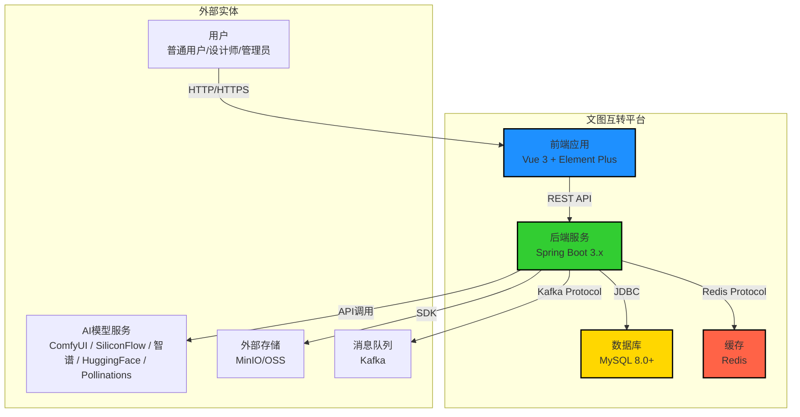
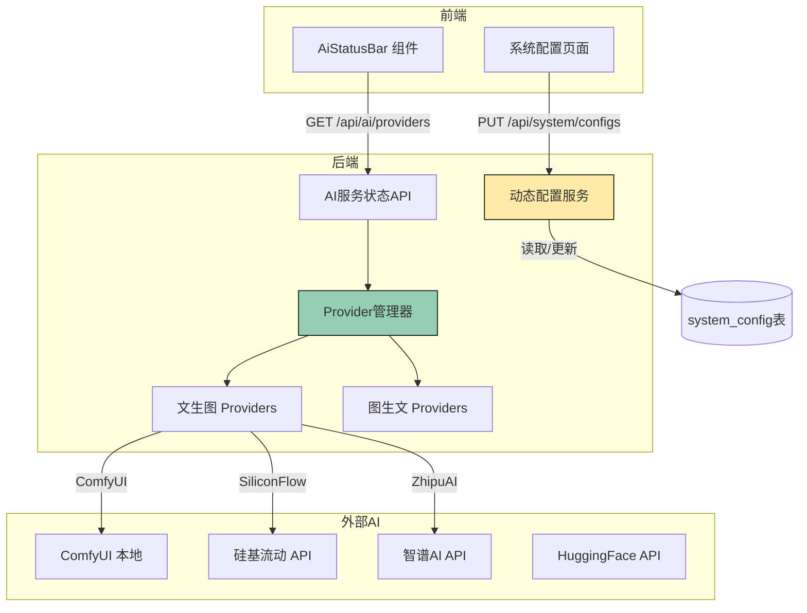
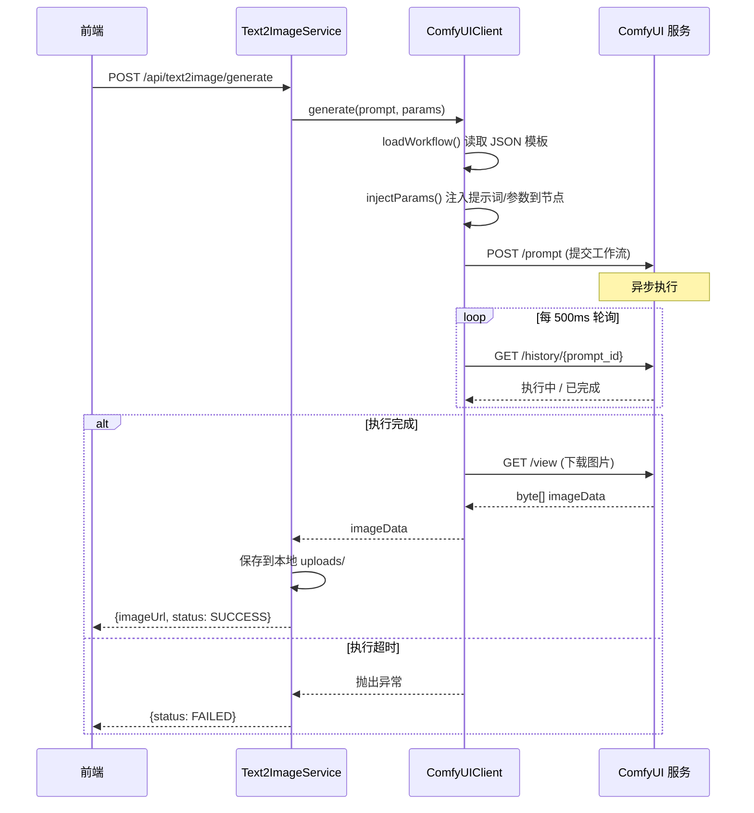
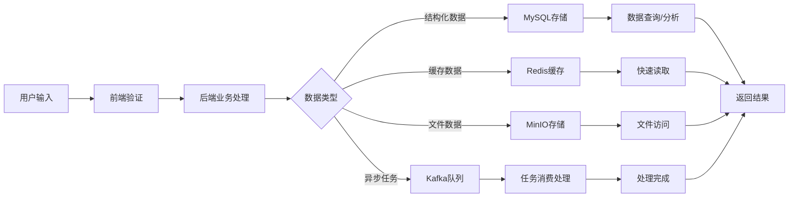
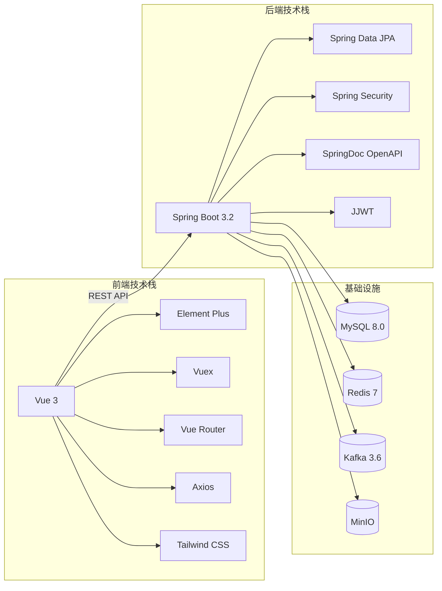
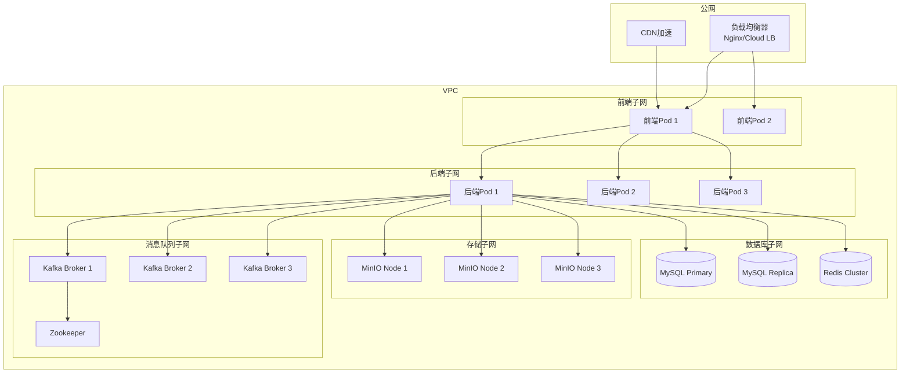
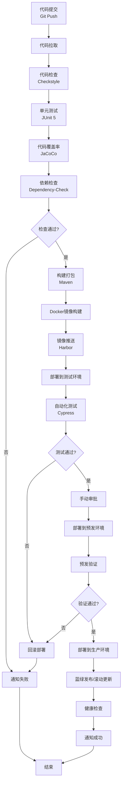
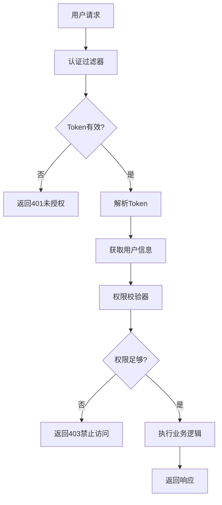

# 文图互转主题设计系统 - 系统架构设计文档

## 1. 系统全景架构 (System Landscape)

### 1.1 系统定位与边界

本系统是一个企业级文图互转主题设计平台，定位为内容生产的"智能中枢"，核心价值在于"创意可复用，风格可积累"。

### 1.2 C4模型 Level 1 - 系统上下文图



### 1.3 核心业务流程

| 流程 | 描述 | 关键路径 |
|-----|------|---------|
| 文生图 | 用户输入文本描述，选择风格，生成图像 | 前端→后端→AI模型→返回图像 |
| 图生文 | 用户上传图像，分析内容生成描述 | 前端→后端→AI模型→返回文本 |
| LoRA训练 | 上传训练数据，配置参数，启动训练 | 前端→后端→消息队列→训练模块→返回结果 |
| 用户管理 | 注册、登录、权限校验 | 前端→后端→数据库→返回token |

---

## 2. 应用架构 (Application Architecture)

### 2.1 模块划分与分层结构

```mermaid
graph TD
    subgraph 表现层 (Presentation Layer)
        FrontendApp[Vue 3 Frontend]
        StaticAssets[静态资源]
    end
    
    subgraph 业务层 (Business Layer)
        UserService[用户服务]
        Text2ImageService[文生图服务]
        Image2TextService[图生文服务]
        StyleService[风格管理服务]
        LoRAService[LoRA训练服务]
        SystemService[系统管理服务]
    end
    
    subgraph 数据访问层 (Data Access Layer)
        UserRepository[用户数据访问]
        ImageRecordRepository[图像记录数据访问]
        StyleRepository[风格数据访问]
        TrainingRepository[训练任务数据访问]
        SystemRepository[系统配置数据访问]
    end
    
    subgraph 基础设施层 (Infrastructure Layer)
        DB[(MySQL)]
        Cache[(Redis)]
        Storage[(MinIO)]
        MQ[(Kafka)]
        AIModels[AI模型接口]
    end
    
    FrontendApp --> UserService
    FrontendApp --> Text2ImageService
    FrontendApp --> Image2TextService
    FrontendApp --> StyleService
    FrontendApp --> LoRAService
    FrontendApp --> SystemService
    
    UserService --> UserRepository
    Text2ImageService --> ImageRecordRepository
    Image2TextService --> ImageRecordRepository
    StyleService --> StyleRepository
    LoRAService --> TrainingRepository
    SystemService --> SystemRepository
    
    UserRepository --> DB
    ImageRecordRepository --> DB
    StyleRepository --> DB
    TrainingRepository --> DB
    SystemRepository --> DB
    
    UserService --> Cache
    Text2ImageService --> Cache
    StyleService --> Cache
    
    Text2ImageService --> Storage
    Image2TextService --> Storage
    StyleService --> Storage
    LoRAService --> Storage
    
    LoRAService --> MQ
    
    Text2ImageService --> AIModels
    Image2TextService --> AIModels
    LoRAService --> AIModels
```

### 2.2 服务间通信

| 通信类型 | 协议 | 说明 |
|---------|-----|------|
| 前端→后端 | REST API (HTTPS) | 同步调用，JSON格式 |
| 后端→数据库 | JDBC | 同步数据访问 |
| 后端→缓存 | Redis Protocol | 键值存储访问 |
| 后端→消息队列 | Kafka Protocol | 异步任务调度 |
| 后端→外部存储 | MinIO SDK | 对象存储操作 |
| 后端→AI模型 | HTTP API | 外部服务调用（ComfyUI / SiliconFlow / 智谱等） |

### 2.4 AI Provider 管理机制



**Provider 切换流程**:
1. 前端 AiStatusBar 下拉框选择 Provider → 调用后端切换 API
2. 后端 `AiProviderManager` 记录当前活跃 Provider
3. 后续生成请求通过当前活跃 Provider 执行
4. Provider 可用性由 `isAvailable()` 方法实时检测

### 2.5 ComfyUI 工作流机制



**Workflow 节点映射**:
| 节点 ID | 功能 | 注入参数 |
|---------|------|---------|
| 26 | 正向提示词(CLIPTextEncode) | prompt, style prompt |
| 22 | 负向提示词(CLIPTextEncode) | negativePrompt |
| 24 | 采样参数(KSampler) | steps, cfgScale, seed, samplerName |
| 25 | 图片尺寸(EmptyLatentImage) | width, height |

### 2.3 模块职责说明

| 模块 | 职责 | 关键功能 |
|-----|------|---------|
| UserService | 用户管理 | 注册、登录、权限校验、个人信息管理 |
| Text2ImageService | 文生图业务 | 文本处理、风格应用、图像生成、结果存储，通过 Text2ImageProvider 策略接口支持多模型切换 |
| Image2TextService | 图生文业务 | 图像上传、内容分析、描述生成，通过 Image2TextProvider 策略接口支持多模型切换 |
| StyleService | 风格管理 | 风格创建、编辑、删除、预览 |
| LoRAService | LoRA训练 | 训练数据管理、参数配置、任务调度、模型下载 |
| SystemService | 系统管理 | 参数配置、日志管理、模型文件管理 |

---

## 3. 数据架构 (Data Architecture)

### 3.1 核心实体关系图 (ER Diagram)

```mermaid
erDiagram
    USER ||--o{ IMAGE_RECORD : creates
    USER ||--o{ STYLE : designs
    USER ||--o{ TRAINING_TASK : creates
    STYLE ||--o{ IMAGE_RECORD : uses
    TRAINING_TASK ||--|| LORA_MODEL : produces
    
    USER {
        bigint id PK "用户ID"
        varchar username "用户名"
        varchar email "邮箱"
        varchar password_hash "密码哈希"
        varchar role "角色: USER/DESIGNER/ADMIN"
        datetime created_at "创建时间"
        datetime updated_at "更新时间"
    }
    
    IMAGE_RECORD {
        bigint id PK "记录ID"
        bigint user_id FK "用户ID"
        bigint style_id FK "风格ID"
        varchar type "类型: TEXT2IMAGE/IMAGE2TEXT"
        text input_content "输入内容"
        text output_content "输出内容"
        varchar image_url "图像URL"
        varchar status "状态: PENDING/SUCCESS/FAILED"
        datetime created_at "创建时间"
    }
    
    STYLE {
        bigint id PK "风格ID"
        bigint designer_id FK "设计师ID"
        varchar name "风格名称"
        text description "风格描述"
        varchar preview_url "预览图URL"
        text config "配置参数(JSON)"
        datetime created_at "创建时间"
        datetime updated_at "更新时间"
    }
    
    TRAINING_TASK {
        bigint id PK "任务ID"
        bigint user_id FK "用户ID"
        varchar name "任务名称"
        varchar status "状态: PENDING/RUNNING/COMPLETED/FAILED"
        text params "训练参数(JSON)"
        varchar data_path "训练数据路径"
        varchar model_path "模型输出路径"
        float progress "进度(0-100)"
        text logs "训练日志"
        datetime created_at "创建时间"
        datetime started_at "开始时间"
        datetime completed_at "完成时间"
    }
    
    LORA_MODEL {
        bigint id PK "模型ID"
        bigint task_id FK "训练任务ID"
        varchar name "模型名称"
        varchar file_path "模型文件路径"
        varchar version "版本号"
        datetime created_at "创建时间"
    }
    
    SYSTEM_CONFIG {
        bigint id PK "配置ID"
        varchar key "配置键"
        varchar value "配置值"
        varchar description "配置说明"
        datetime updated_at "更新时间"
    }
```

### 3.2 数据存储选型

| 数据类型 | 存储方案 | 选型理由 |
|---------|---------|---------|
| 业务数据 | MySQL 8.0+ | 关系型数据，事务支持，成熟稳定 |
| 缓存数据 | Redis | 高频访问数据缓存，会话管理 |
| 文件存储 | MinIO | 图像、模型文件存储，支持分布式部署 |
| 消息队列 | Kafka | 异步任务调度，解耦训练流程 |

### 3.3 数据流转流程



---

## 4. 技术架构 (Technology Stack)

### 4.1 技术选型总览

| 层级 | 技术 | 版本 | 选型理由 |
|-----|-----|-----|---------|
| **语言** | Java | 21 | LTS版本，性能稳定，生态成熟，适合企业级后端服务 |
| **框架** | Spring Boot | 3.2.x | 社区成熟，生态完善，便于快速构建RESTful服务 |
| **ORM** | MyBatis-Plus | 3.5.x | 简化数据访问层开发，支持多数据库适配 |
| **前端框架** | Vue | 3.4.x | 响应式设计，TypeScript支持，学习曲线平缓 |
| **UI组件库** | Element Plus | 2.x | 基于Vue 3，组件丰富，文档完善 |
| **状态管理** | Vuex | 4.x | 集中式状态管理，适合中大型应用 |
| **路由** | Vue Router | 4.x | Vue官方路由库，支持嵌套路由 |
| **数据库** | MySQL | 8.0+ | 生产环境首选，性能优秀，社区活跃 |
| **数据库** | H2 | 2.2.x | 测试环境使用，内存数据库，启动快 |
| **缓存** | Redis | 7.x | 高性能键值存储，支持多种数据结构 |
| **消息队列** | Kafka | 3.6.x | 高吞吐，分布式，适合异步任务处理 |
| **AI 推理** | ComfyUI | latest | 本地文生图推理引擎，基于 Stable Diffusion workflow 工作流 |
| **文件存储** | MinIO | 2024.x | 轻量级对象存储，兼容S3 API |
| **构建工具** | Maven | 3.9.x | Java生态标准构建工具 |
| **API文档** | SpringDoc OpenAPI | 2.3.x | 自动生成API文档，支持Swagger UI |
| **单元测试** | JUnit 5 | 5.10.x | Java最新测试框架，支持Lambda表达式 |
| **Mock工具** | Mockito | 5.x | 强大的Mock框架，便于单元测试 |

### 4.2 技术架构图



---

## 5. 部署架构 (Deployment Architecture)

### 5.1 网络拓扑图



### 5.2 环境分层

| 环境 | 用途 | 配置特点 |
|-----|-----|---------|
| 开发环境 | 本地开发调试 | H2数据库，单机Redis，无Kafka |
| 测试环境 | 集成测试 | H2/MySQL数据库，单机Redis/Kafka |
| 预发环境 | 生产前验证 | 与生产环境配置一致，数据隔离 |
| 生产环境 | 正式运行 | 高可用配置，多副本部署 |

### 5.3 CI/CD 流水线



---

## 6. 安全架构 (Security Architecture)

### 6.1 认证与授权体系



### 6.2 安全措施清单

| 安全类别 | 措施 | 实现方式 |
|---------|-----|---------|
| **认证** | JWT Token | 无状态认证，过期时间控制 |
| **授权** | RBAC | 角色-权限映射，基于Spring Security |
| **传输加密** | HTTPS | TLS 1.3，证书管理 |
| **存储加密** | AES-256 | 敏感字段加密存储 |
| **密码安全** | BCrypt | 强哈希算法，加盐处理 |
| **防攻击** | WAF | 防止SQL注入、XSS、CSRF |
| **DDoS防护** | 流量清洗 | 限流、熔断、降级 |
| **访问控制** | 安全组 | 网络层面隔离 |

### 6.3 权限矩阵

| 角色 | 权限范围 | 说明 |
|-----|---------|------|
| 普通用户 | 仅访问个人资源 | 文生图、图生文、历史记录、个人设置 |
| 设计师 | 个人资源 + 风格管理 + LoRA训练 | 继承普通用户权限 |
| 管理员 | 全部资源 | 继承设计师权限 + 用户管理 + 系统配置 + 日志管理 |

---

## 7. 可观测性设计

### 7.1 监控体系

| 监控类型 | 工具 | 监控指标 |
|---------|-----|---------|
| 应用监控 | Prometheus + Grafana | CPU、内存、请求数、响应时间 |
| 日志收集 | ELK Stack | 应用日志、访问日志、错误日志 |
| 链路追踪 | Zipkin | 请求链路、调用耗时、异常追踪 |
| 健康检查 | Spring Actuator | 应用健康状态、磁盘空间、数据库连接 |

### 7.2 告警策略

| 告警级别 | 触发条件 | 通知方式 |
|---------|---------|---------|
| 紧急 | 服务不可用、数据库连接池耗尽 | 短信 + 电话 + 钉钉 |
| 严重 | 请求超时率>5%、错误率>1% | 钉钉 + 邮件 |
| 警告 | CPU使用率>80%、内存使用率>85% | 邮件 |
| 提示 | 配置变更、部署完成 | 钉钉 |

---

## 8. 架构特点总结

| 特性 | 设计实现 | 价值 |
|-----|---------|-----|
| **高可用** | 多副本部署、MySQL主从、Redis集群 | 减少单点故障，保证业务连续性 |
| **可扩展** | 微服务架构、Kubernetes编排 | 支持水平扩展，应对业务增长 |
| **安全性** | JWT认证、RBAC授权、数据加密 | 保障数据安全与访问控制 |
| **可维护性** | 清晰分层、代码规范、完善监控 | 降低运维成本，便于问题定位 |
| **可观测性** | 全链路监控、结构化日志、智能告警 | 快速发现和解决问题 |
