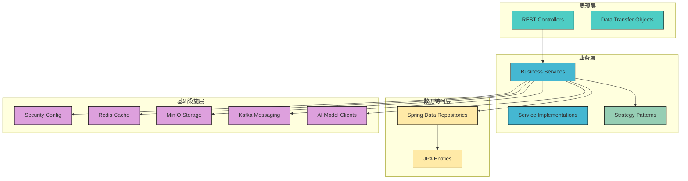
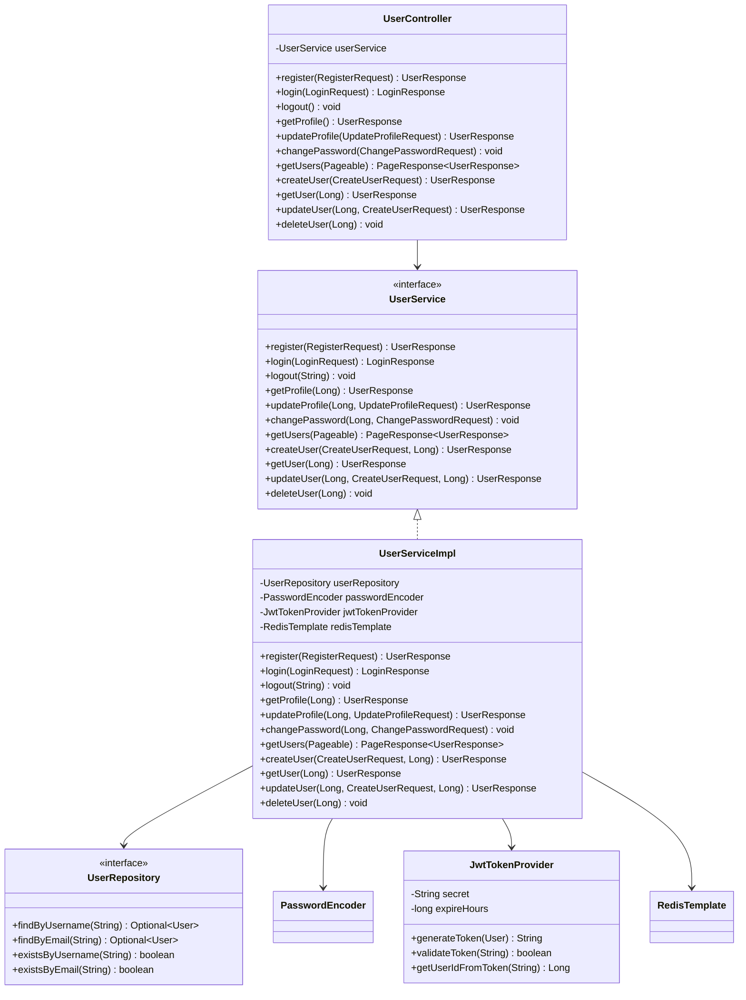
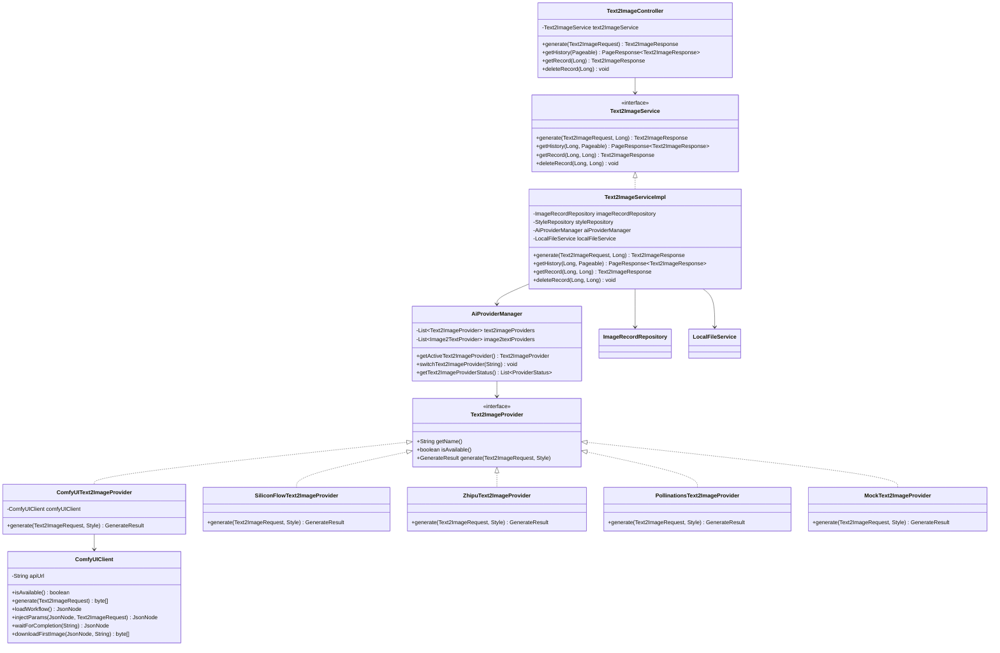
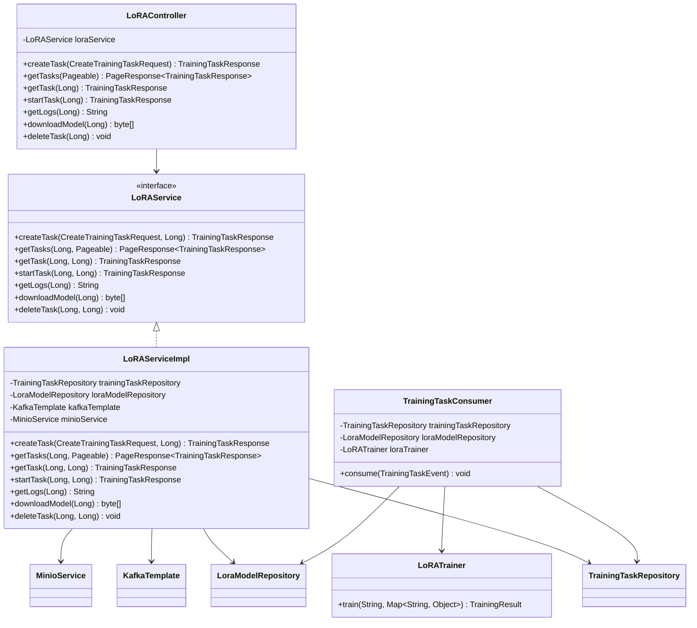
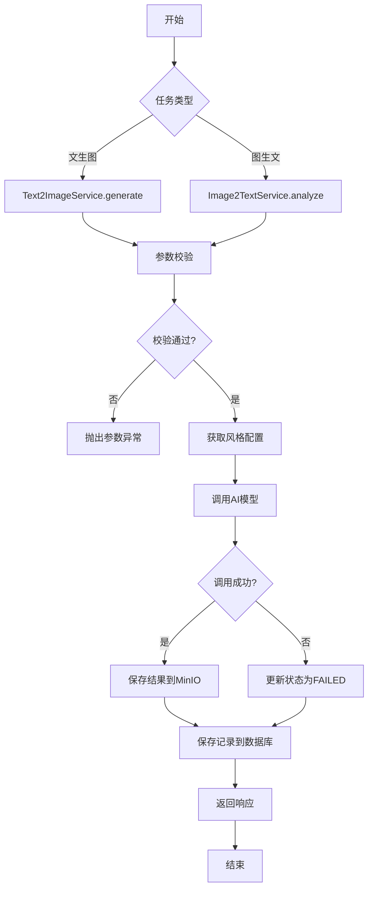
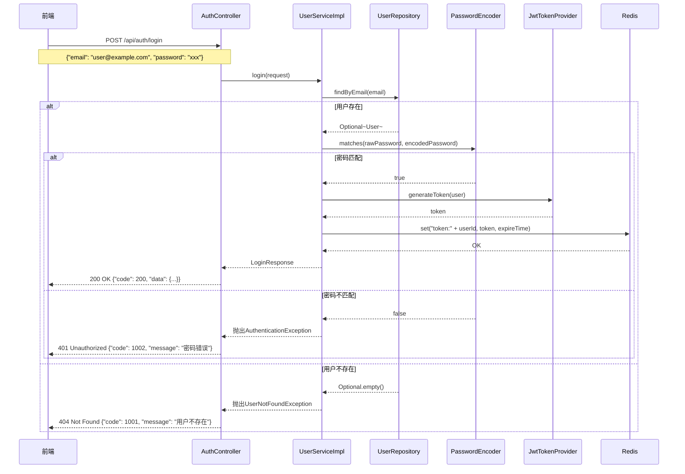
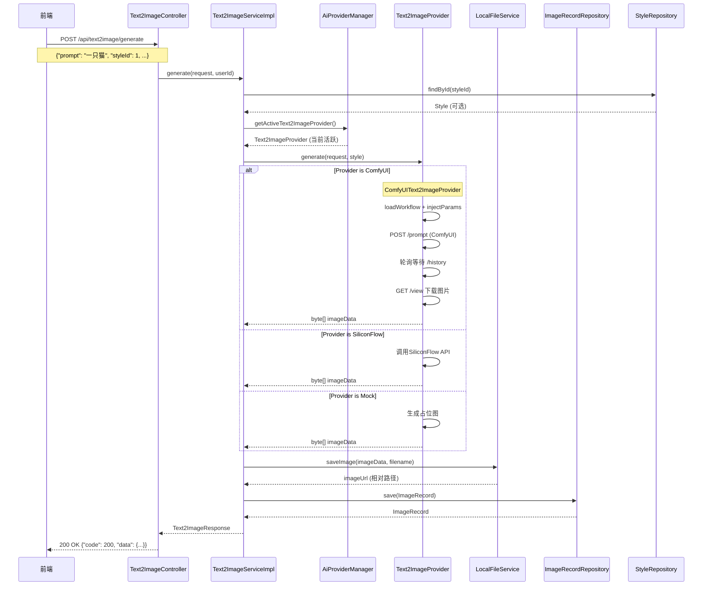
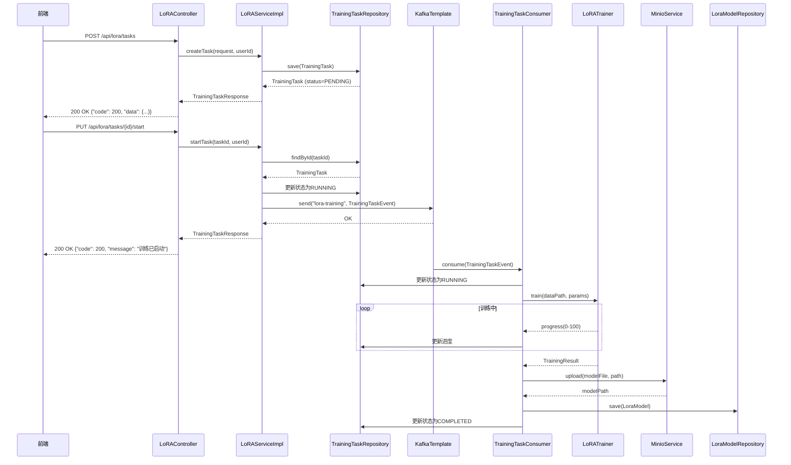
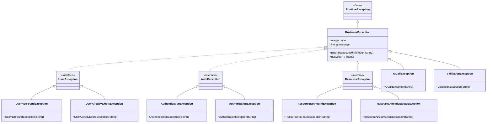
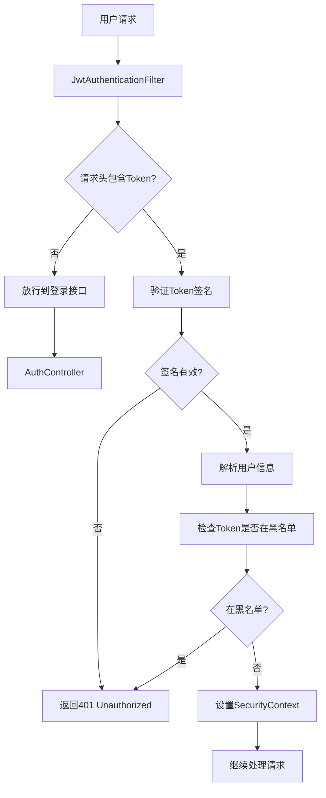

# 文图互转主题设计系统 - 软件详细设计说明书

## 1. 分层架构设计

### 1.1 架构分层



### 1.2 各层职责定义

| 层级 | 职责 | 主要组件 |
|-----|-----|---------|
| **表现层** | 处理HTTP请求/响应，参数校验，调用业务层 | Controller、DTO |
| **业务层** | 实现业务逻辑，事务管理，调用数据访问层 | Service、Strategy |
| **数据访问层** | 数据库CRUD操作，实体映射 | Repository、Entity |
| **基础设施层** | 提供基础服务（安全、缓存、存储、消息队列） | Security、Redis、MinIO、Kafka |

### 1.3 DTO定义

#### 请求DTO

| DTO名称 | 用途 | 字段 |
|--------|-----|-----|
| RegisterRequest | 用户注册 | username, email, password |
| LoginRequest | 用户登录 | email, password |
| UpdateProfileRequest | 更新个人信息 | username, email, avatarUrl |
| ChangePasswordRequest | 修改密码 | oldPassword, newPassword, confirmPassword |
| CreateUserRequest | 创建用户（管理员） | username, email, password, role |
| Text2ImageRequest | 文生图请求 | prompt, styleId, width, height, steps, cfgScale, seed |
| Image2TextRequest | 图生文请求 | image (MultipartFile) |
| CreateStyleRequest | 创建风格 | name, description, previewUrl, config |
| UpdateStyleRequest | 更新风格 | name, description, previewUrl, config |
| CreateTrainingTaskRequest | 创建训练任务 | name, params, dataPath |

#### 响应DTO

| DTO名称 | 用途 | 字段 |
|--------|-----|-----|
| UserResponse | 用户信息 | id, username, email, role, avatarUrl, createdAt |
| LoginResponse | 登录响应 | token, user |
| Text2ImageResponse | 文生图响应 | id, prompt, imageUrl, styleId, styleName, status, createdAt |
| Image2TextResponse | 图生文响应 | id, imageUrl, description, tags, status, createdAt |
| StyleResponse | 风格响应 | id, name, description, previewUrl, config, status, createdAt |
| TrainingTaskResponse | 训练任务响应 | id, name, status, params, progress, logs, createdAt, startedAt, completedAt |
| PageResponse\<T\> | 分页响应 | content, totalElements, totalPages, currentPage |

## 2. 核心类设计

### 2.1 用户管理模块类图



### 2.2 文生图模块类图



### 2.3 LoRA训练模块类图



## 3. 设计模式应用

### 3.1 策略模式 - AI模型调用

**应用场景**: 支持多种AI模型（ComfyUI、SiliconFlow、智谱AI、HuggingFace、Pollinations等）进行文生图和图生文操作

```mermaid
graph TD
    A[Text2ImageServiceImpl] --> B{AiProviderManager}
    B -->|getActiveText2ImageProvider()| C[当前活跃 Provider]
    C -->|ComfyUI| D[ComfyUIText2ImageProvider]
    C -->|SiliconFlow| E[SiliconFlowText2ImageProvider]
    C -->|智谱AI| F[ZhipuText2ImageProvider]
    C -->|Pollinations| G[PollinationsText2ImageProvider]
    C -->|Mock| H[MockText2ImageProvider]
    
    D --> I[ComfyUIClient.generate]
    I --> I1[loadWorkflow 加载JSON模板]
    I1 --> I2[injectParams 注入参数到节点]
    I2 --> I3[POST /prompt 提交工作流]
    I3 --> I4[轮询 /history 等待完成]
    I4 --> I5[GET /view 下载图片]
    I5 --> J[返回图片数据]
    
    E --> J
    F --> J
    G --> J
    H --> J
    
    J --> K[保存到本地 uploads 目录]
```

**设计理由**:
- `Text2ImageProvider` 接口定义 `generate()` / `isAvailable()` / `getName()`
- 各 Provider 通过 `@Component` 自动注入到 `AiProviderManager`
- `AiProviderManager` 管理当前活跃 Provider，支持运行时切换
- 前端 `AiStatusBar` 下拉框切换 → `POST /api/ai/text2image/switch` → 即时生效
- 符合开闭原则（对扩展开放，对修改关闭）

### 3.2 ComfyUI 客户端设计

**应用场景**: 通过 HTTP API 调用本地的 ComfyUI 推理引擎，基于 workflow 工作流模板生成图片

```java
// 核心调用流程
public class ComfyUIClient {
    // 1. 加载 workflow JSON 模板
    JsonNode workflow = loadWorkflow("comfyui_default.json");
    
    // 2. 注入参数到工作流节点
    //    节点 26: 正向提示词 (CLIPTextEncode)
    //    节点 22: 负向提示词 (CLIPTextEncode)
    //    节点 24: 采样参数 (KSampler) — steps, cfgScale, seed, samplerName
    //    节点 25: 图片尺寸 (EmptyLatentImage) — width, height
    JsonNode prompt = injectParams(workflow, request);
    
    // 3. 提交工作流，获取 prompt_id
    String promptId = submitPrompt(prompt);
    
    // 4. 轮询等待执行完成
    JsonNode history = waitForCompletion(promptId);
    
    // 5. 从 outputs 解析图片并下载
    byte[] image = downloadFirstImage(history, apiUrl);
}
```

**关键设计点**:
- Workflow JSON 模板位于 `resources/workflow/comfyui_default.json`
- API 地址通过 `DynamicConfigService` 运行时读取（DB → yml 兜底），支持管理后台修改即时生效
- 超时控制：默认 120s（`ai.comfyui.timeout`），轮询间隔 500ms
- 文件存储：图片下载后保存到 `backend/uploads/text2image/{date}/` 目录

### 3.3 模板方法模式 - 统一处理流程

**应用场景**: 文生图和图生文的处理流程有相似的步骤（参数校验、调用AI、保存结果）



## 4. 交互流程时序图

### 4.1 用户登录流程



### 4.2 文生图流程



### 4.3 LoRA训练流程



## 5. 异常处理设计

### 5.1 异常类体系



### 5.2 全局异常处理器

```java
// 伪代码示例
@RestControllerAdvice
public class GlobalExceptionHandler {
    
    @ExceptionHandler(BusinessException.class)
    public ResponseEntity<Result<Void>> handleBusinessException(BusinessException e) {
        return ResponseEntity.badRequest()
            .body(Result.error(e.getCode(), e.getMessage()));
    }
    
    @ExceptionHandler(ResourceNotFoundException.class)
    public ResponseEntity<Result<Void>> handleResourceNotFoundException(ResourceNotFoundException e) {
        return ResponseEntity.status(HttpStatus.NOT_FOUND)
            .body(Result.error(404, e.getMessage()));
    }
    
    @ExceptionHandler(AuthorizationException.class)
    public ResponseEntity<Result<Void>> handleAuthorizationException(AuthorizationException e) {
        return ResponseEntity.status(HttpStatus.FORBIDDEN)
            .body(Result.error(403, e.getMessage()));
    }
    
    @ExceptionHandler(MethodArgumentNotValidException.class)
    public ResponseEntity<Result<Void>> handleValidationException(MethodArgumentNotValidException e) {
        String message = e.getBindingResult().getFieldErrors().stream()
            .map(error -> error.getField() + ": " + error.getDefaultMessage())
            .collect(Collectors.joining(", "));
        return ResponseEntity.badRequest()
            .body(Result.error(400, message));
    }
    
    @ExceptionHandler(Exception.class)
    public ResponseEntity<Result<Void>> handleException(Exception e) {
        // 记录日志
        log.error("Unexpected error", e);
        return ResponseEntity.status(HttpStatus.INTERNAL_SERVER_ERROR)
            .body(Result.error(500, "服务器内部错误"));
    }
}
```

### 5.3 错误码规范

| 错误码范围 | 类别 | 说明 |
|----------|-----|-----|
| 1001-1999 | 用户相关 | 用户不存在、用户已存在、密码错误等 |
| 2001-2999 | 资源相关 | 资源不存在、资源已存在等 |
| 3001-3999 | 业务逻辑 | 训练任务不存在、任务已在运行等 |
| 4001-4999 | 文件操作 | 文件上传失败、文件不存在等 |
| 5001-5999 | 外部服务 | AI模型调用失败、存储服务异常等 |
| 6001-6999 | 系统错误 | 数据库异常、缓存异常等 |

## 6. 安全设计

### 6.1 认证流程



### 6.2 授权流程

```mermaid
flowchart TD
    A[用户请求] --> B[MethodSecurityInterceptor]
    B --> C{检查@PreAuthorize注解}
    
    C -->|无注解| D[允许访问]
    
    C -->|有注解| E[解析权限表达式]
    E --> F[获取当前用户角色]
    F --> G{角色匹配?}
    
    G -->|是| D
    
    G -->|否| H[返回403 Forbidden]
```

### 6.3 Spring Security配置结构

| 配置项 | 说明 |
|-------|-----|
| JwtAuthenticationFilter | JWT Token过滤器，验证Token有效性 |
| JwtAuthorizationFilter | 授权过滤器，检查用户权限 |
| UserDetailsServiceImpl | 用户详情服务，从数据库加载用户 |
| PasswordEncoder | BCrypt密码编码器 |
| SecurityFilterChain | 安全过滤链配置 |

---

**文档版本**: v1.0  
**创建日期**: 2026-05-10  
**适用框架**: Spring Boot 3.2.x
